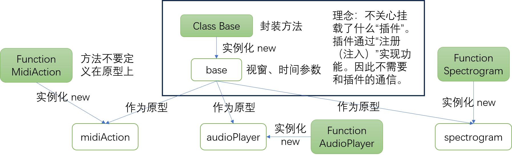

# 废案
耦合实在太严重了，解耦不能，写不下去了。js是基于对象但是不适合面向对象，少用class、将js的灵活性发扬光大才是正道。而且这个应用也不会new几次，用类实现没什么意义。
## 原计划
midi绘制在另一个画布上……吗？时间指针呢？——我想，还是绘制在同一个画布上吧。。。如果dom多了，首先事件就不好绑定。用一个画布，但是用多个类实现不同部分的绘制。数据交互可以由顶层管理。困难的地方在于数据交互与共享。
我想，做成接口的形式。虽然是一个类，但是可以加上不同的接口，负责不同的功能。这样就可以复用一个对象了。
钢琴键盘用另一个画布和类实现。
所有的事件通过一个总的类布置，实现宏观调控。
```
如果单独实现每一个render = {
    画时频er = {
        X滚动值
        Y滚动值
        每格的宽度
        每格的高度
        横向缩放(鼠标位置，程度)
        大小调整(新的大小)

        时频数据
        强度颜色映射()
        画时频(X滚动值，Y滚动值，每格的宽度，每格的高度，时频数据)
    }
    画midier = {
        X滚动值
        Y滚动值
        每格的宽度
        每格的高度
        横向缩放(鼠标位置，程度)
        大小调整(新的大小)

        midi数据
        画midi(X滚动值，Y滚动值，每格的宽度，每格的高度，midi数据)
    }
    鼠标跟随（鼠标操作） = {
        每格的高度
        鼠标y坐标
        按下的位置
        松开的位置

        画高亮(鼠标的y坐标)
        松开时区域
    }
}
```
## 已经做了什么
用原型链实现单向数据访问（类的实例作为），作为根基的base类没有办法访问其下插件。实现了插件1：画时频谱。

但是插件之间的通信比我想象的多而复杂，所以这个系统不能胜任。